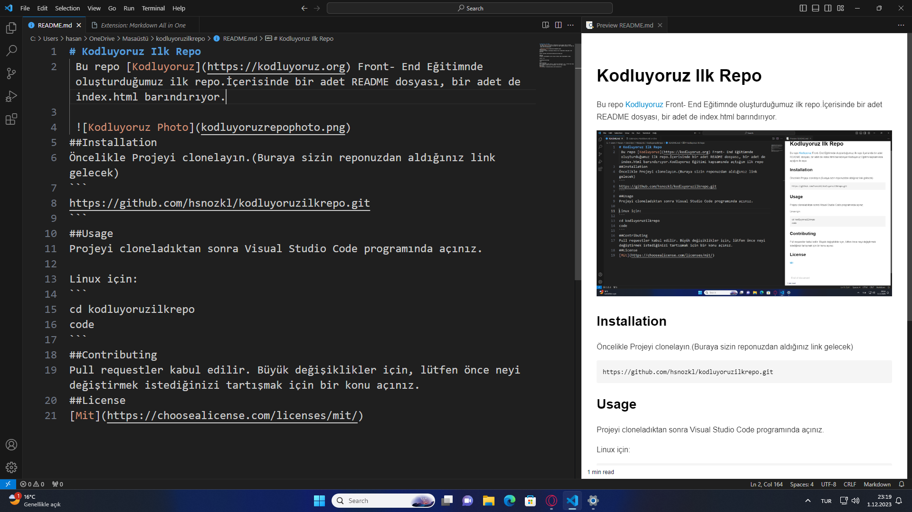

# Kodluyoruz Ilk Repo
 Bu repo [Kodluyoruz](https://kodluyoruz.org) Front- End Eğitimnde oluşturduğumuz ilk repo.İçerisinde bir adet README dosyası, bir adet de index.html barındırıyor.

 

## Installation

Öncelikle Projeyi clonelayın.(Buraya sizin reponuzdan aldığınız link gelecek)
```
https://github.com/hsnozkl/kodluyoruzilkrepo.git
```
## Usage
Projeyi cloneladıktan sonra Visual Studio Code programında açınız.

Linux için:
```
cd kodluyoruzilkrepo
code
```
## Contributing
Pull requestler kabul edilir. Büyük değişiklikler için, lütfen önce neyi değiştirmek istediğinizi tartışmak için bir konu açınız.

## License

[Mit](https://choosealicense.com/licenses/mit/)